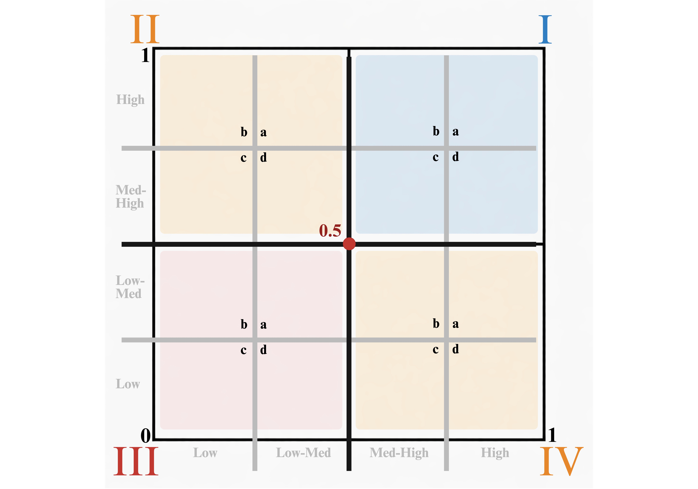
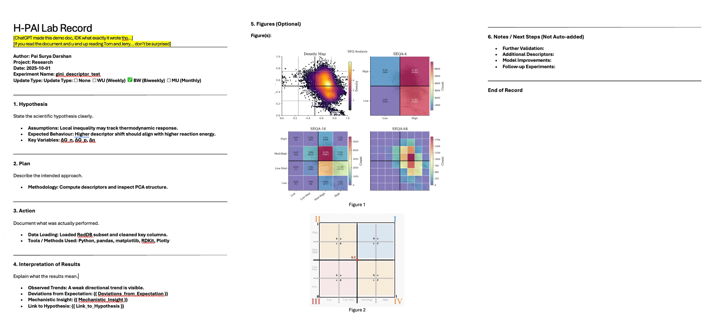

# PaisAssistantTools

This folder contains lightweight helper modules used to support the main RedDB analysis workflow.

> It is a trimmed subset of a larger personal utilities repository, with only the parts that are relevant to this project or potentially useful to other users kept here.
> (Full repository on [My GitHub](https://github.com/PaiSuryaDarshan) [Full Link will be made available.])

The tools in this folder are mainly intended to:

- Maintain consistent plotting style.
- Repeat Analysis code out of the phase notebooks.
- Make figures more visually consistent across the project.
- Provide reusable helper functions for exploratory descriptor analysis.

## Files

### `PaiStyle_1.py`

Provides a central Matplotlib style configuration for the project. It applies a consistent plotting setup on import, including figure resolution, serif fonts, axis styling, legend behaviour, and general visual defaults so plots across different notebooks share the same appearance.

---

### `SEQA.py`

Implements SEQA, short for <u>**Symmetric Equal Quadrant Analysis**</u>, as a reusable analysis tool for two-column numerical data. The module takes an input dataframe, cleans and rescales the selected variables when needed, assigns each point to quadrants and finer sub-regions, computes summary tables, and builds a 2x2 dashboard of visual outputs.

The summary output is designed to stay compact and useful. It includes:

- extrema information, showing the strongest high/low points in the analysed x-y space
- quadrant counts (I-IV), showing how points are distributed across the four main regions

- region counts (Ia-IVd), showing the finer 16-part occupancy pattern
- inequality-style metrics, used to describe how evenly or unevenly the data is spread

In practice, this makes it useful for analysing how pairs are distributed across a shared space, identifying concentration or imbalance patterns, and comparing both global quadrant occupancy and finer regional structure.

The module is designed so the same workflow can be reused across different data / axis combinations without rewriting the analysis logic each time.

**What makes this good?**

The script can automatically identify if given data is rescaled or not and adjust accordingly.

NEW! : Introduce Gini metric, complements the pre-exisiting entropy metric. Entropy is a scalar measure probability spread, whereas Gini is a scalar measure of Dominance / inequality between points.

Example dashboard output plot:

An example summary is not shown here because it contains project-specific data.

---

### `HPAI.py`

Implements H-PAI, short for <u>**Hypothesis, Plan, Action, Interpretation of Results**</u>, as a lightweight structured recording tool for experiments and computational workflows.

It fills a predefined Word template by replacing placeholders (e.g., `{{Assumption}}`, `{{Figure}}`) with user-provided content and optionally inserts selected figures.

The structure enforces a clear reasoning pipeline:

- Hypothesis → what is being tested
- Plan → how it will be tested
- Action → what was actually done
- Interpretation → what the results mean

**What makes this useful?**

It reduces the friction of documenting work by removing the need to manually set up files, formats, or structure. Instead of spending time organising notes, you can focus directly on thinking and recording.

The fixed H-PAI structure enforces concise, high-signal summaries, making it easier to capture key insights without over-writing or losing clarity.

This lowers the barrier to consistent documentation and encourages regular, disciplined recording across experiments and analyses.

Example output file:

---

### `.py`
